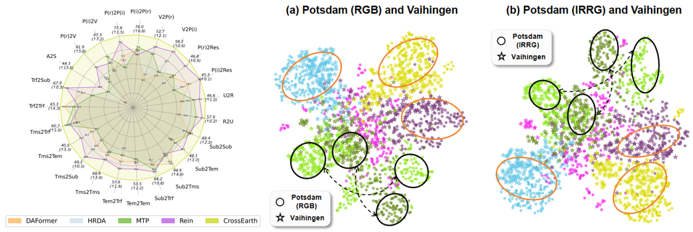

 
<div align="center">

<h1> CrossEarth: Geospatial Vision Foundation Model for Domain Generalizable Remote Sensing Semantic Segmentation</h1>


[Ziyang Gong](https://scholar.google.com/citations?user=cWip8QgAAAAJ&hl=zh-CN&oi=ao)<sup>1 ∗</sup>, [Zhixiang Wei](https://scholar.google.com/citations?user=i5W4i9YAAAAJ&hl=zh-CN&oi=sra)<sup>2 ∗</sup>, [Di Wang](https://scholar.google.com/citations?user=3fThjewAAAAJ&hl=zh-CN&oi=sra)<sup>3 ∗</sup>, Xianzheng Ma<sup>3</sup>, [Hongruixuan Chen](https://scholar.google.com/citations?user=XOk4Cf0AAAAJ&hl=zh-CN&oi=ao)<sup>4</sup>, [Yuru Jia](https://scholar.google.com/citations?user=62c9GI0AAAAJ&hl=zh-CN&oi=ao)<sup>56</sup>, [Yupeng Deng](https://scholar.google.com/citations?user=H5X8NDQAAAAJ&hl=zh-CN&oi=ao)<sup>1</sup>, Zhenming Ji<sup>1 †</sup>, Xiangwei Zhu<sup>1 †</sup>, Naoto Yokoya<sup>4</sup>, Jing Zhang<sup>3</sup>, Bo Du<sup>3</sup>, Liangpei Zhang<sup>3</sup>

<sup>1</sup> Sun Yat-sen University, <sup>2</sup> University of Science and Technology of China, <sup>3</sup> Wuhan University, 

<sup>4</sup> The University of Tokyo, <sup>5</sup> KU Leuven, <sup>6</sup> KTH Royal Institute of Technology

<sup>∗</sup> Equal contribution, <sup>†</sup> Corresponding author

 


<a href="https://cuzyoung.github.io/CrossEarth-Homepage/"></a>
<a href="https://mp.weixin.qq.com/"></a>
<a href="https://www.linkedin.com/in/ziyang-gong-382a182b1/"></a>
<a href="https://mp.weixin.qq.com/"></a>
<a href="https://mp.weixin.qq.com/"> </a>


</div>
<br>
<br>

# 🔥🔥🔥 News

- The environment and inference steps please refer to the following installation. The inference codes and weights will be coming soon.

- The benchmark collection in the paper is releasing and you can access it at [here](https://github.com/Cuzyoung/CrossEarth/tree/main/benchmarks). 

- 🎉🎉🎉 CrossEarth is the first VFM for Remote Sensing Domain Generalization (RSDG) semantic segmentation. We just release the arxiv paper of CrossEarth. You can access CrossEarth at [here](https://arxiv.org/abs/2410.12345). 


# 📑 Table of Content
- [Visualization](#visualization)
- [Environment Requirements](#environment-requirements)
- [Inference steps](#inference-steps)
- [Training steps](#training-steps)
- [Model Weights with Configs](#model-weights-with-configs)
<!-- - [Citation](#citation)
 -->


## Visualization  
__In Radar figure:__
- CrossEarth achieves SOTA performances on 23 evaluation benchmarks across various segmentation scenes, demonstrating strong generalizability.

__In UMAP figures:__
- CrossEarth extracts features that cluster closely for the same class across different domains, forming well-defined groups in feature space, demonstrating its ability to learn robust, domain-invariant features.

- Moreover, CrossEarth features exhibit high inter-class separability, forming unique clusters for each class and underscoring its strong representational ability to distingguish different categories.




## Environment Requirements:
```bash
conda create -n CrossEarth -y
conda activate CrossEarth
conda install pytorch==2.0.1 torchvision==0.15.2 torchaudio==2.0.2 pytorch-cuda=11.7 -c pytorch -c nvidia -y
pip install -U openmim
mim install mmengine
mim install "mmcv>=2.0.0"
pip install "mmsegmentation>=1.0.0"
pip install "mmdet>=3.0.0"
pip install xformers=='0.0.20' 
pip install -r requirements.txt
pip install future tensorboard
```
## Inference steps:

First, download the model weights and put them in the ./checkpoints folder (we are uploading, and not available now).
```bash
cd checkpoints
run download_weights.py
```
or you can download the weights from the google drive or Baidu Netdisk in the above badges.

Second, change the file path in experiment config files (__configs/base/datasets/xxx.py__ and __configs/CrossEarth_dinov2/xxx.py__), and run the following command to inference. (Take 512x512 inference as an example)
```bash
python tools/test.py configs/CrossEarth_dinov2/CrossEarth_dinov2_mask2former_512x512_bs1x4.py ./checkpoints/xxx.pth
```
Notably, save path of pseudo labels is in the experiment config file. When testing CrossEarth on different benchmarks, you also need to change the class number in [CrossEarth_dinov2_mask2former.py](https://github.com/Cuzyoung/CrossEarth/blob/main/configs/_base_/models/CrossEarth_dinov2_mask2former.py) file.

## Training steps:

Coming soon.

## Model Weights with Configs

| Dataset | Benchmark | Model | Config | Log |
|----------|----------|-------| -------| ----|
|ISPRS Potsdam and Vaihingen|P(i)2V| Coming Soon | Coming Soon |Coming Soon |
|-  |P(i)2P(r)| - | - |- |
|-  |P(r)2P(i)| Coming Soon | Coming Soon |Coming Soon |
|-  |P(r)2V| - | - |- |
|-  |V2P(i)| Coming Soon | Coming Soon |Coming Soon |
|-  |V2P(r)| -| - |- |
|LoveDA|Urban2Rural| Coming Soon | Coming Soon |Coming Soon |
|-  |Rural2Urban| Coming Soon | Coming Soon |Coming Soon |
|WHU Building|A2S| Coming Soon | Coming Soon |Coming Soon |
|-  |S2A| Coming Soon | Coming Soon |Coming Soon |
|DeepGlobe and Massachusetts |D2M| Coming Soon | Coming Soon |Coming Soon |
|ISPRS Potsdam and RescueNet|P(r)2Res| Coming Soon | Coming Soon |Coming Soon |
|-  |P(i)2Res| Coming Soon | Coming Soon |Coming Soon |
|CASID|Sub2Sub| Coming Soon | Coming Soon |Coming Soon |
|-  |Sub2Tem| - | - |- |
|-  |Sub2Tms| - | - |-|
|-  |Susb2Trf| - | - |- |
|-  |Tem2Sub| Coming Soon | Coming Soon |Coming Soon |
|-  |Tem2Tem| - | - |- |
|-  |Tem2Tms| - | - |- |
|-  |Tem2Trf| - | - |- |
|-  |Tms2Sub| Coming Soon | Coming Soon |Coming Soon |
|-  |Tms2Tem| - | - |- |
|-  |Tms2Trf| - | - |- |
|-  |Trf2Sub| Coming Soon | Coming Soon |Coming Soon |
|-  |Trf2Tem| - | - |- |
|-  |Trf2Tms| - | - |- |
|-  |Trf2Trf| - | - |- |


# Citation

If you find CrossEarth helpful, please consider giving this repo a ⭐ and citing:

```
@article{crossearth,
  title={CrossEarth: Geospatial Vision Foundation Model for Domain Generalizable Remote Sensing Semantic Segmentation},
  author={Gong, Ziyang and Wei, Zhixiang and Wang, Di and Ma, Xianzheng and Chen, Hongruixuan and Jia, Yuru and Deng, Yupeng and Ji, Zhenming and Zhu, Xiangwei and Yokoya, Naoto and Zhang, Jing and Du, Bo and Zhang, Liangpei},
  journal={arXiv preprint arXiv:2410.12345},
  year={2024}
}
```
# Other Related Works
- [MTP: Advancing remote sensing foundation model via multi-task pretraining](https://arxiv.org/abs/2403.13430)
- [Stronger, Fewer, & Superior: Harnessing Vision Foundation Models for Domain Generalized Semantic Segmentation](https://arxiv.org/abs/2312.04265)


