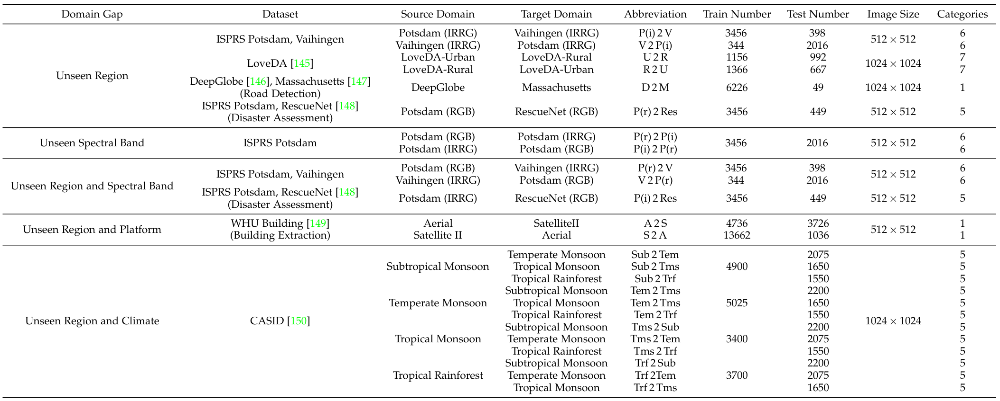

# Benchmark Collection
Here is the benchmark collection in CrossEarth paper. In this page, we will release the download links, and pre-process scripts of benchmarks. 



# Table of Content
- [Potsdam and Vaihingen](#potsdam-and-vaihingen)
- [LoveDA](#loveda)
- [WHU-Building](#whu-building)
- [DeepGlobe and Massachusetts](#deepglobe-and-massachusetts)
- [Potsdam and RescuNet](#potsdam-and-rescuenet)
- [CAISD](#caisd) 


## Potsdam and Vaihingen
First, Link to MMSegmentation Page [here](https://mmsegmentation.readthedocs.io/zh-cn/main/user_guides/2_dataset_prepare.html) to find the Potsdam and Vaihingen section.

For Potsdam dataset, download '3_Ortho_RGB.zip', '3_Ortho_IRRG.zip', and '5_Labels_all_noBoundary.zip'.

For Vaihingen dataset, download 'ISPRS_semantic_labeling_Vaihingen.zip' and 'ISPRS_semantic_labeling_Vaihingen_ground_truth_eroded_COMPLETE.zip'.

Second, Process the Potsdam dataset (respectively process RGB and IRRG): 
```bash
python tools/dataset_converters/potsdam.py /path/to/potsdam
```
Third, Process the Vaihingen dataset: 
```bash
python tools/dataset_converters/vaihingen.py /path/to/vaihingen
```
(Optional) Notably, the label id of Potsdam and Vaihingen is from 1-6. Make sure label id is consistent and you can use this script to check it.
```bash
python tools/check_label_id.py --folder-path /path/to/potsdam --dataset potsdam
python tools/check_label_id.py --folder-path /path/to/vaihingen --dataset vaihingen
```
The structure of the processed dataset should be like this:
```
CrossEarth
    - Potsdam
        -IRRG
            - img_dir
                - train
                - val
            - ann_dir
                - train
                - val
        -RGB
            - img_dir
                - train
                - val
            - ann_dir
                - train
                - val
    - Vaihingen
        - img_dir
            - train
            - val
        - ann_dir
            - train
            - val
```
## LoveDA
First, download 'LoveDA-CrossEarth.zip' dataset from [Huggingface](https://huggingface.co/datasets/Cusyoung/CrossEarth-Benchmark/tree/main) and [BaiduNetdisk](https://pan.baidu.com/s/1PrCKuYaSLW31pZ-P7e95xw?pwd=h78a) and put it in the 'datasets/LoveDA' folder.

or Download with wget in MMSegmentation Page:
```bash
cd datasets
mkdir LoveDA
cd LoveDA
wget https://zenodo.org/record/5706578/files/Train.zip
wget https://zenodo.org/record/5706578/files/Val.zip
wget https://zenodo.org/record/5706578/files/Test.zip   
```

Second, process the LoveDA dataset: 
```bash
python tools/dataset_converters/loveda.py /path/to/loveDA
```
(Optional) Notably, the label id of LoveDA is from 1-7. Make sure label id is consistent and you can use this script to check it.
```bash
python tools/check_label.py --folder-path /path/to/loveDA --dataset loveda
```
The structure of the processed LoveDA dataset should be like this:
```
datasets
    - LoveDA
        - Train
            - Rural
                - images_png
                - masks_png
            - Urban
                - images_png
                - masks_png
        - Val
            - Rural
                - images_png
                - masks_png
            - Urban
                - images_png
                - masks_png
```
## WHU-Building
First, download WHU-Building dataset from [Huggingface](https://huggingface.co/datasets/Cusyoung/CrossEarth-Benchmark/tree/main) and [BaiduNetdisk](https://pan.baidu.com/s/1PrCKuYaSLW31pZ-P7e95xw?pwd=h78a) and put it in the 'datasets/' folder.

Second, unzip the WHU-Building dataset: 
```bash
python tools/dataset_converters/whu_building.py /path/to/whu_building
```
(Optional) Notably, the label id of WHU-Building is from 0-1. Make sure label id is consistent and you can use this script to check it.
```bash
python tools/check_label.py --folder-path /path/to/whu_building --dataset building
```
The structure of the processed WHU-Building dataset should be like this:
```

## DeepGlobe and Massachusetts
First, download 'Massachusetts.zip' dataset from [Huggingface](https://huggingface.co/datasets/Cusyoung/CrossEarth-Benchmark/tree/main) and BaiduNetdisk Badges and put it in the 'datasets/' folder.

Second, unzip the Massachusetts dataset: 
```bash
cd datasets
mkdir Massachusetts
cd Massachusetts
unzip Massachusetts.zip 
```
Third, download 'DeepGlobe.zip' dataset from [Huggingface](https://huggingface.co/datasets/Cusyoung/CrossEarth-Benchmark/tree/main) and [BaiduNetdisk](https://pan.baidu.com/s/1PrCKuYaSLW31pZ-P7e95xw?pwd=h78a) and put it in the 'datasets' folder.

Fourth, unzip the DeepGlobe dataset: 
```bash
cd ..
mkdir DeepGlobe
cd DeepGlobe
unzip DeepGlobe.zip 
```
(Optional) Notably, the label id of Massachusetts and DeepGlobe is from 0-1. Make sure label id is consistent and you can use this script to check it.
```bash
python tools/check_label.py --folder-path /path/to/massachusetts --dataset road
python tools/check_label.py --folder-path /path/to/deepglobe --dataset road
```
The structure of the Massachusetts and DeepGlobe dataset should be like this:
```
datasets
    - Massachusetts
        -tiff
            - train
            - train_labels
            - val
            - val_labels
            - test
            - test_labels
    - DeepGlobe
        -train
        -valid
        -test
```

## Potsdam and RescuNet
<!-- For the Potsdam and RescuNet, we need to conduct label mapping process to unify Potsdam and RescuNet labels. -->
 
 We recommend to directly download the processed Potsdam_Res and RescuNet datasets from [Huggingface](https://huggingface.co/datasets/Cusyoung/CrossEarth-Benchmark/tree/main) and [BaiduNetdisk](https://pan.baidu.com/s/1PrCKuYaSLW31pZ-P7e95xw?pwd=h78a).

(Optional) Notably, the label id of Potsdam_Res and RescuNet is from 1-6. Make sure label id is consistent and you can use this script to check it.
```bash
python tools/check_label.py --folder-path /path/to/potsdam_res --dataset potsdam_res
python tools/check_label.py --folder-path /path/to/rescuenet --dataset rescuenet
```

## CAISD
We recommend to directly download the processed 'CAISD.zip' dataset from [Huggingface](https://huggingface.co/datasets/Cusyoung/CrossEarth-Benchmark/tree/main) and [BaiduNetdisk](https://pan.baidu.com/s/1PrCKuYaSLW31pZ-P7e95xw?pwd=h78a).

(Optional) Notably, the label id of CAISD is from 1-5. Make sure label id is consistent and you can use this script to check it.
```bash
python tools/check_label.py --folder-path /path/to/caisd --dataset caisd
```
